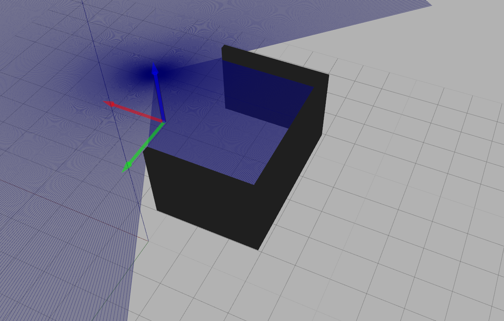

# SonarGazeboSim


# Instalacion

- Instalar ROS se recomiendo usar estas instrucciones http://wiki.ros.org/kinetic/Installation/Ubuntu. Se desarrollo en un inicio con la version indigo, pero se probo que funcionara para kinetic.

- Activar variables de entorno globales, permiten usar catkin
```
source /opt/ros/kinetic/setup.bash
```

- Crear un ambiente de desarrollo con catkin. 
```
mkdir -p ~/catkin_ws/src
cd ~/catkin_ws
catkin_make
```
Deberia salir que se compilo algo. Esto ha generado un ambiente de trabajo sobre el cual se agregara este proyecto.

- Es necesario agregar estas carpetas al path de paquetes. Esto se logra con el siguiente comando. El segundo comando es para verificar (deberia tener el path a la carpeta catkin_ws)
```
source devel/setup.bash
echo $ROS_PACKAGE_PATH
```
- Entrar a src y clonar este repositorio

```
cd src
git clone https://github.com/aferral/SonarGazeboSim
```

- Compilar para activar los package. Deberia mencionar un package llamado sonar_sim.

```
cd ..
catkin_make
```

- Por ultimo falta compilar el simulador en C. Este requiere tener instalado opencv2 (probado utilizando version 2.4). Se recomiendo probar con el comando pkg-config --libs --cflags opencv para ver que todo este en orden
```
cd SonarGazeboSim/src/simuladorC 
make

(OPCIONAL SI FALLA LO ANTERIOR utilizando CMakeLists.txt)

mkdir build
cd build
cmake-gui .. # Esto va abrir una interfaz para configurar variables de entorno

# Es necesario configurar solamente la variable OpenCV_DIR a la ubicacion de los cmake de open cv
# Los archivos a buscar son la carpeta donde se encuentra OpenCVConfig.cmake OpenCVConfig-version.cmake
# Normalmente esto es algun share
# Despues de configurar presionar Generate y verificar que sea exitosa la generacion
cmake .. # Esto compila el archivo MakeFile
make   # Esto genera los binarios (deberia crearse un binario llamado out)
mv out .. # Esto mueve out a la carpeta padre
./out   # Esto deberia mostrar la simulacion en funcionamiento (verificar que este el archivo out.txt antes de ejecutar


```
Si la compilacion fue exitosa todo deberia estar listo.

# Uso

Lo primero a realizar siempre es activar las variables de entorno (desde carpeta catkin_ws)
```
source devel/setup.bash
```
Ahora realizar el levantamiento  del escenario de ejemplo con 
```
roslaunch src/SonarGazeboSim/launch/ej.launch
```
Deberia abrirse un escenario con el simulador gazebo en el cual hay un pilar y 3 paredes. El pilar tiene un su parte superior el sensor laser.
La idea es mover este pilar a la posicion deseada antes de llamar la captura de datos.



Ahora en otra ventana (volver a activar el workspace) y ejectar el nodo de obtencion de geometria. Este nodo espera una señal para realizar la captura del laser (que simula al sonar)

```
source devel/setup.bash

rosrun sonar_sim getGeometry.py
```
Por ultimo realizar el llamado de obtencion de geometria con 
```
source devel/setup.bash
rosservice call /getGeo 1
```
El parametro no tiene importancia. Esta señal hace que se creen los archivos de simulacion dada la geometria captada por el laser.


# Archivos de salida

Posterior a todo el proceso se generan los siguientes archivos
* outSensor.txt : Tiene la señal en el tiempo entregada por el simulador en C (dada la geometria y posicion sensor)
* out.json : Entrega la geometria y datos de simulacion en un formato json. Era utilizado para unas simulaciones en matlab (librearia k-wave)
* senalSensor.png : Grafico de la señal descrita en outSensor.txt
* outCanvas.png: Entrega la geometria captada por el sensor como una imagen binaria.

